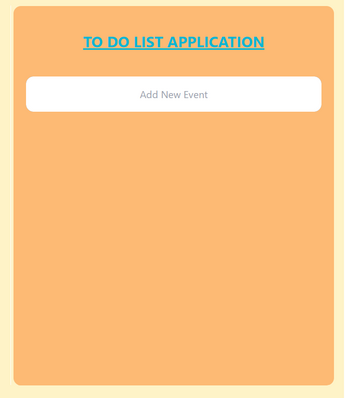
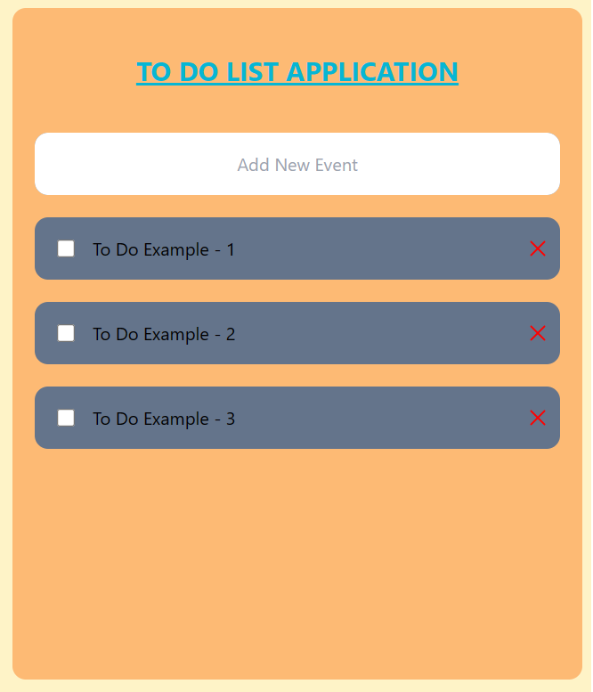
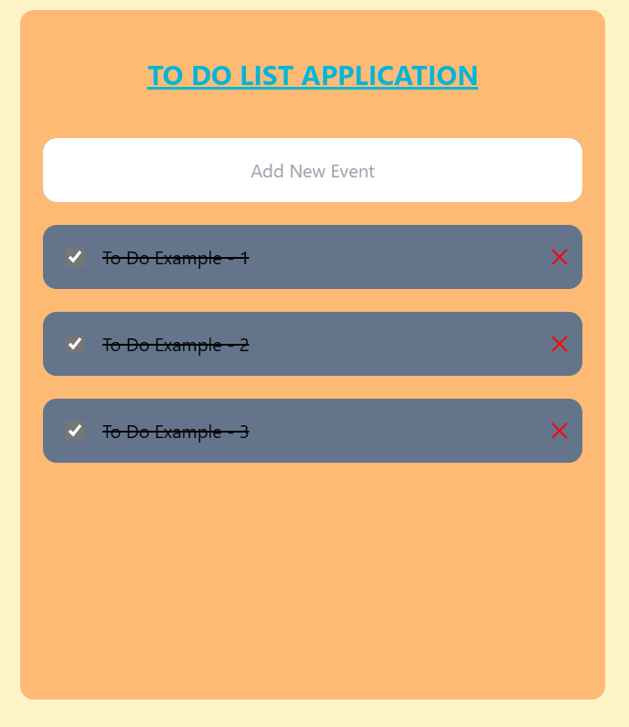
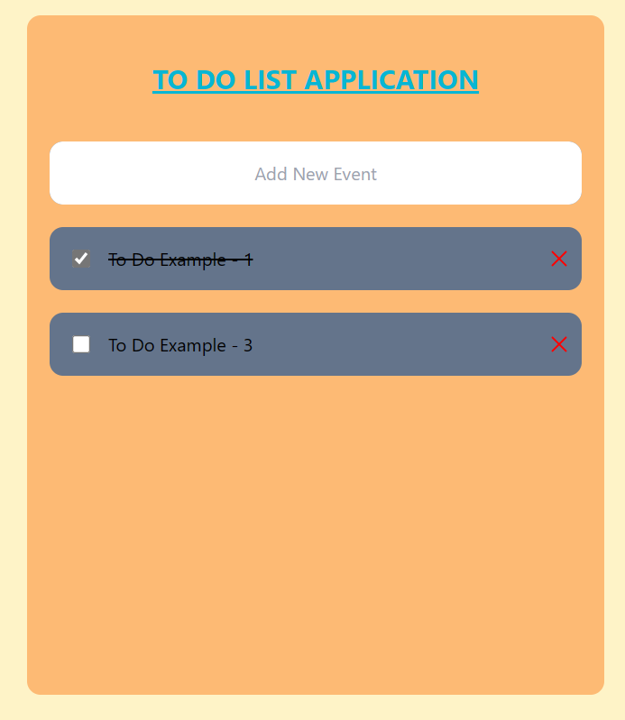

# "My Basic To Do List with ReactJs and tailwind fundamentals"

This project is my first project on the path of learning React and Tailwind.

## "Components and Props"

"This project is designed to practice creating a component by using many different components rather than solving a problem, and to practice communication between different components through props properties."

### "What can you accomplish using this project?"

1 -> You can create a new activity you want and add it to your list.
2 -> You can mark the activity you added to the list as completed when you finish it.
3 -> You can remove any activity you added to the list from the list.

### "How can I use this project?"

1-> Firstly, you should install React and Node.js on your computer.
2->Then, you should install the necessary packages by using the following codes:

```
npx create-react-app my-project
cd my-project
npm install -D tailwindcss
npx tailwindcss init
```
3->Afterwards, you should download the source code shared here and place it in your project folder (you can delete the other files except for the 'node_modules' folder in your project before placing the downloaded files).
4->"Afterwards, the only thing you need to do is to run the project by using the command 'npm run start'."


{width=50%; height=25%;}

{width=50%; height=25%;}

{width=50%; height=25%;}

{width=50%; height=25%;}
